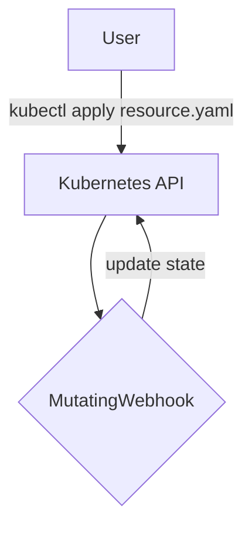

# Mutating Webhooks

## Introduction

Mutating webhooks are most frequently used for setting default values. 
They can modify objects by creating a patch that will be sent back in the admission response.



## Example Mutating Webhook

```csharp
[Webhook(
    name: "pod-policy.neonkube.io",
    serviceName: "example-operator",
    @namespace: "default",
    admissionReviewVersions: "v1",
    failurePolicy: "Ignore")]
[WebhookRule(
    apiGroups: V1Pod.KubeGroup,
    apiVersions: V1Pod.KubeApiVersion, 
    operations: AdmissionOperations.Create | AdmissionOperations.Update, 
    resources: V1Pod.KubePluralName,
    scope: "*")]
public class PodWebhook : IMutatingWebhook<V1Pod>
{
    private Ilogger logger { get; set; }

    private bool modified = false;

    public PodWebhook(Ilogger logger)
        : base()
    {
        this.logger = logger;
    }

    public async Task<MutationResult> CreateAsync(V1Pod entity, bool dryRun)
    {
        logger.LogInformation($"Received create request for pod {entity.Namespace()}/{entity.Name()}");

        if (modified)
        {
            return await Task.FromResult(MutationResult.Modified(entity));
        }

        return await Task.FromResult(MutationResult.NoChanges());
    }

    public async Task<MutationResult> UpdateAsync(V1Pod entity, V1Pod oldEntity, bool dryRun)
    {
        logger.LogInformation($"Received update request for pod {entity.Namespace()}/{entity.Name()}");

        if (modified)
        {
            return await Task.FromResult(MutationResult.Modified(entity));
        }

        return await Task.FromResult(MutationResult.NoChanges());
    }
```