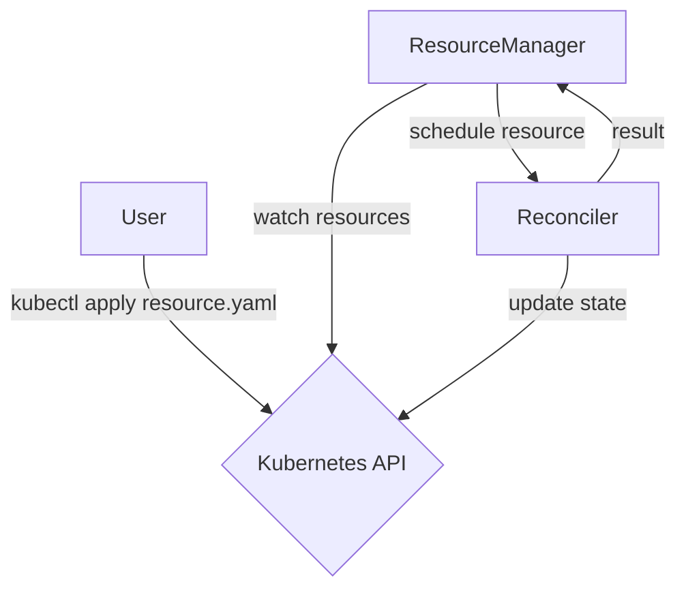

# Resource Controllers

## Introduction

Resource Controllers are called when Kubernetes resources are created, modified, or deleted.
They are configured to watch specific resource types, have methods for responding to such updates.



## Reconciler

Reconcilers are responsible for bringing the actual state of a resource to the desired state, which is expressed in the
Custom Resource object specification.

When a reconcile event is triggered, it is always passed the current state of the resource to be reconciled.

:::danger A reconciler must be [idempotent](https://en.wikipedia.org/wiki/Idempotence)

A function is said to be idempotent if it can be applied multiple times without changing the result beyond the initial application.
:::

### Triggers

Reconcile is triggered by the following events:

- A resource has been created.
- A resource has been updated.
- A resource failed reconciliation and was requeued.
- An object with an [`ownerReference`](https://kubernetes.io/docs/concepts/overview/working-with-objects/owners-dependents/#owner-references-in-object-specifications)
  to the resource.

### Example

In its simplest form, this is what the `ReconcileAsync` method looks like:

```csharp
public Task<ResourceControllerResult> ReconcileAsync(V1ExampleEntity resource)
{
    // TODO: apply logic

    return ResourceControllerResult.Ok();
}
```

## Status Updates

`StatusModifiedAsync` is called when the status of a resource has changed.

```csharp
public async Task StatusModifiedAsync(V1ExampleEntity resource)
{
    // react to status update
}
```

## Requeuing

When a reconcile event throws an exception, it will be requeued.

### Global defaults

Global defaults can be configured by setting `ResourceManagerOptions` in `ConfigureOperator`.

```csharp
var k8s = KubernetesOperatorHost
            .CreateDefaultBuilder()
            .ConfigureOperator(configure =>
            {
                configure.ResourceManagerOptions = new ResourceManagerOptions()
                {
                    ErrorMaxRequeueInterval = TimeSpan.FromMinutes(1),
                    ErrorMaxRetryCount      = 10,
                    ErrorMinRequeueInterval = TimeSpan.FromSeconds(1)
                };
            })
            .UseStartup<Startup>()
            .Build();

await = k8s.RunAsync();
```

### Controller specific

Controllers are configurable by passing `ResourceManagerOptions` to your controller when calling `AddController` in `Startup.cs`.

:::note

To do this, assembly scanning should be disabled or add the `[Controller(Ignore = true)]` attribute to the controller.

:::

```csharp
using Neon.Kube.Operator;
using Neon.Kube.Operator.ResourceManager;

public void ConfigureServices(IServiceCollection services)
{
    services.AddKubernetesOperator()
            .AddController<ExampleController>(
            options: new ResourceManagerOptions()
            {
                ErrorMaxRequeueInterval = TimeSpan.FromMinutes(1),
                ErrorMaxRetryCount = 10,
                ErrorMinRequeueInterval = TimeSpan.FromSeconds(1)
            });
}
```

### Manual requeue

```csharp
public Task<ResourceControllerResult> ReconcileAsync(V1ExampleEntity resource)
{
    return ResourceControllerResult.RequeueEvent(TimeSpan.FromSeconds(10));
}
```

## Leader election

### Events

The following methods are provided for reacting to leadership events.

```csharp
public async Task OnPromotionAsync()
{
    // Controller was promoted to leader.
}

public async Task OnDemotionAsync()
{
    // Controller is no longer leader.
}

public async Task OnNewLeaderAsyncc(string identity)
{
    // There is a new leader. The identity of the new leader is given.
}
```

### Configuring

Leader election can be configured by setting `LeaderElectionConfig` when adding a controller via `AddController` in `Startup.cs`.

:::note

To do this, assembly scanning should be disabled or add the `[Controller(Ignore = true)]` attribute to the controller.

:::

```csharp
using Neon.Kube;
using Neon.Kube.Operator;

public void ConfigureServices(IServiceCollection services)
{
    services.AddKubernetesOperator()
            .AddController<ExampleController>(
                leaderConfig: new LeaderElectionConfig(
                    k8s:           K8s,
                    @namespace:    "default",
                    leaseName:     $"example.controller",
                    identity:      Pod.Name))
}
```

## Filtering

Filtering resources can be achieved by applying [field selectors](https://kubernetes.io/docs/concepts/overview/working-with-objects/field-selectors/) and/or [label selectors](https://kubernetes.io/docs/concepts/overview/working-with-objects/labels/).
Both label selectors and field selectors are comma-separated `key=value` strings.

### Field Selectors

Field selectors can be set either by the `Controller` attribute, or by the `ResourceManagerOptions.FieldSelector` property.

```csharp
[Controller(FieldSelector = "metadata.name=my-resource")]
public class ExampleController : IResourceController<ExampleResource>

```

### Label Selectors

Field selectors can be set either by the `Controller` attribute, or by the `ResourceManagerOptions.FieldSelector` property.

```csharp
[Controller(LabelSelector = "neonkube.io/managed-by=my-operator,neonkube.io/controlled-by=example-controller")]
public class ExampleController : IResourceController<ExampleResource>

```

## Dependent Resources

In many cases, an operator creates a bunch of Kubernetes resources in the cluster, as a result of reconciling a `Resource`. For instance, the etcd-operator creates
two services and a number of pods for a single EtcdCluster CR. In this case, all the Kubernetes resources created by the operator for a CR is defined as
dependent resources. The etcd-operator may want to watch the pods that it created in case it needs to reconcile again.

`DependentResources` can be defined by adding an annotation to the `Controller`.

```csharp
using Neon.Kube.Operator;
using Neon.Kube.Operator.Controller;
using Neon.Kube.Resources;

[DependentResource<V1Pod>]
[DependentResource<V1Service>]
public class EtcdController : IResourceController<V1EtcdCluster>
{
   // Controller implementation.
}
```

Controllers are configurable by setting `DependentResources` in `ResourceManagerOptions` when adding a controller via `AddController` in `Startup.cs`.

:::note

To do this, assembly scanning should be disabled or add the `[Controller(Ignore = true)]` attribute to the controller.

:::

```csharp
using Neon.Kube.Operator;
using Neon.Kube.Operator.ResourceManager;
using Neon.Kube.Resources;

public void ConfigureServices(IServiceCollection services)
{
    services.AddKubernetesOperator()
        .AddController<EtcdController>(
            options: new ResourceManagerOptions()
            {
                DependentResources = new List<IDependentResource>()
                {
                    new DependentResource<V1Pod>(),
                    new DependentResource<V1Service>()
                }
            });
}

```
