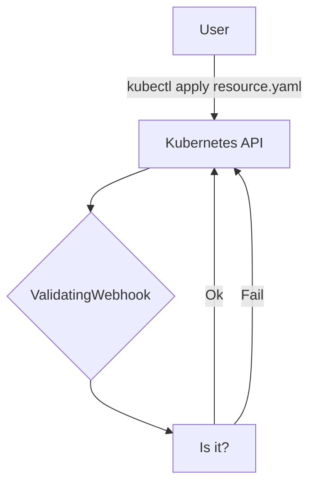

import Admonition from "@theme/Admonition";
import CodeBlock from "@theme/CodeBlock";
import Image from "@theme/IdealImage";
import TabItem from "@theme/TabItem";
import Tabs from "@theme/Tabs";

# Validating Webhooks

## Introduction

Validating webhooks can be used to perform validations that go beyond the
capabilities of OpenAPI schema validation. A validating Webhook can reject the
request, but it cannot modify the object received in the request.



## Example

```csharp
[Webhook(
    name: "pod-policy.neonkube.io",
    admissionReviewVersions: "v1",
    failurePolicy: "Ignore")]
[WebhookRule(
    apiGroups: V1Pod.KubeGroup,
    apiVersions: V1Pod.KubeApiVersion,
    operations: AdmissionOperations.Create | AdmissionOperations.Update,
    resources: V1Pod.KubePluralName,
    scope: "*")]
public class PodWebhook : ValidatingWebhookBase<V1Pod>
{
    public override async Task<ValidationResult> CreateAsync(V1Pod entity, bool dryRun)
    {
        if (entity.Metadata.Name == "invalid-entity")
        {
            return ValidationResult.Fail(statusCode: 500, statusMessage: "Entity name is not valid.");
        }

        return ValidationResult.Success();
    }

    public override async Task<ValidationResult> UpdateAsync(V1Pod entity, V1Pod oldEntity, bool dryRun)
    {
        if (entity.Metadata.Name == "invalid-entity")
        {
            return ValidationResult.Fail(statusCode: 500, statusMessage: "Entity name is not valid.");
        }

        return ValidationResult.Success();
    }
}
```
